# WPの投稿

## ダッシュボードのメニューから投稿のページへ移動

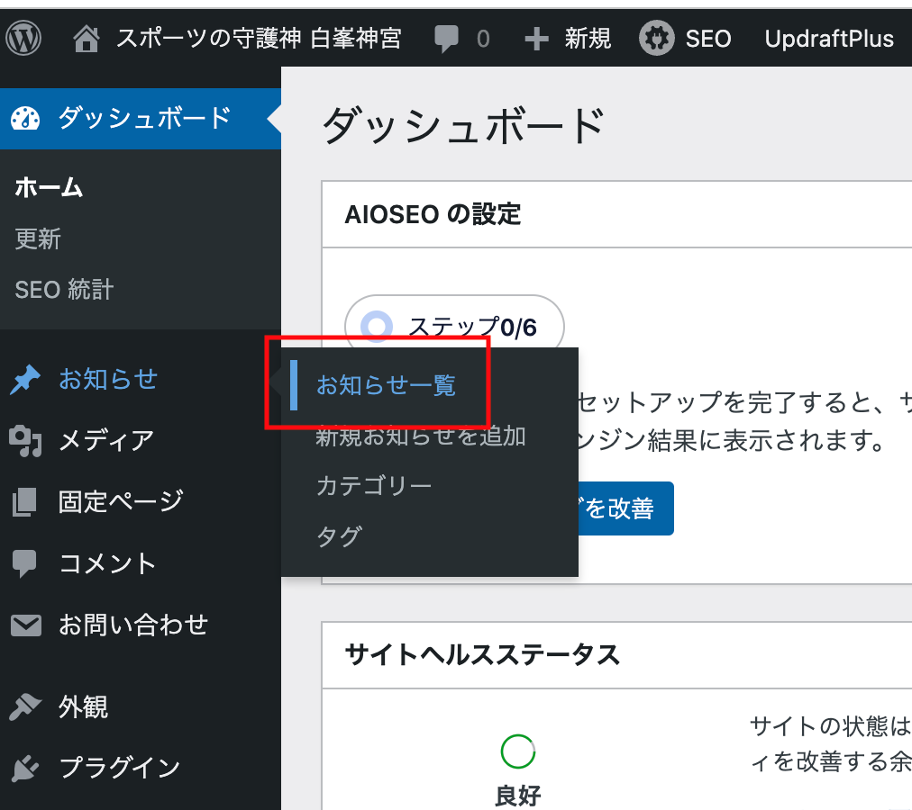

## 投稿する

赤囲みのボタンを押すと新規投稿画面が開きます。

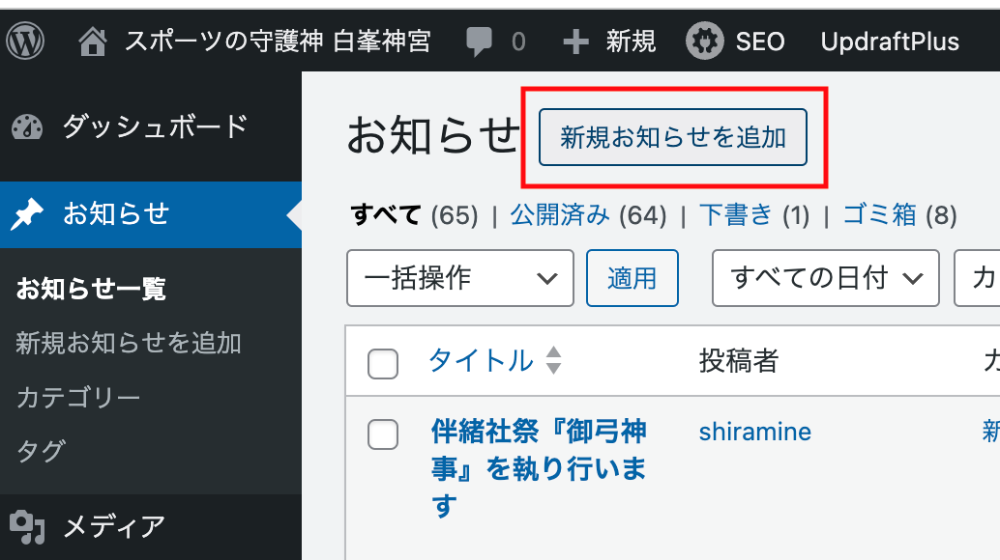
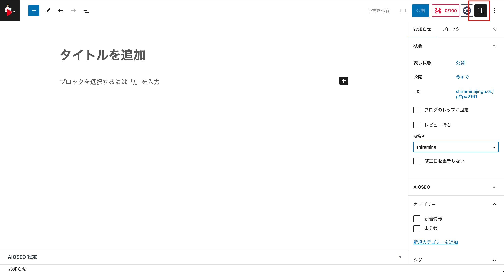

`赤囲みのボタン`を押して右のメニューを出し以下を確認してください。

* 投稿者を`shiramine`にする。
* カテゴリーは`新着情報`にチェックをいれる。

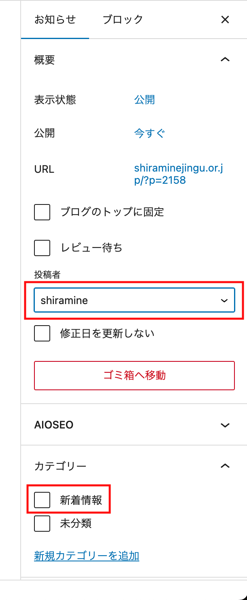

## 記事を書く

赤枠をしている`黒いプラスアイコン`をクリックするとメニューが現れます。
下の`すべて表示`をクリックして画面左側にツールメニューを表示させてください。

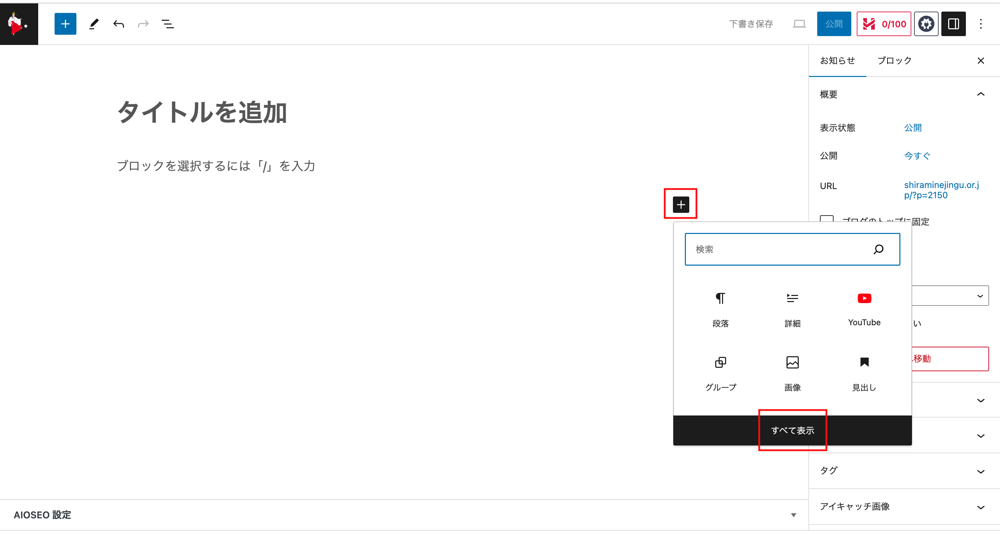

メニュー内にカーソルを持っていき入力するテキストの属性を選択することができます。

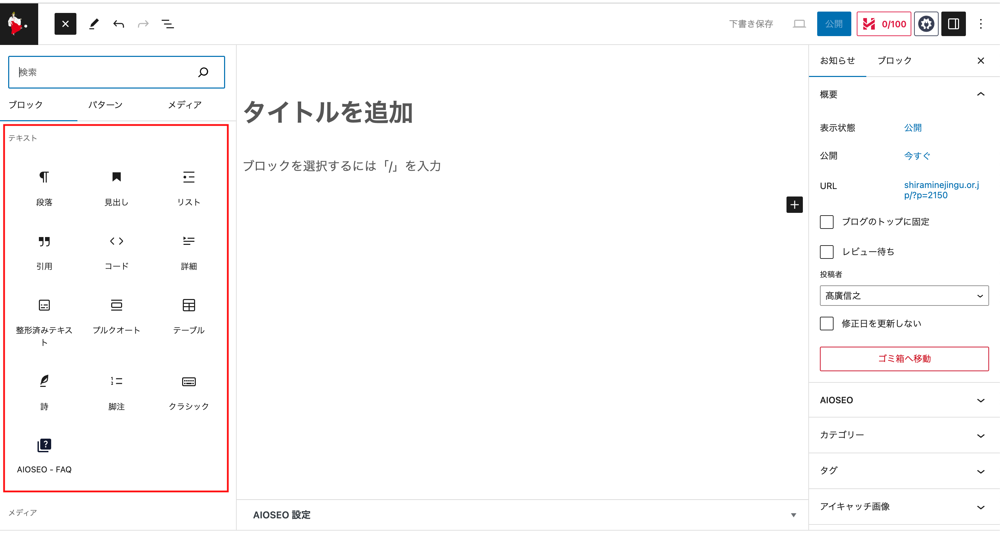

テキスト入力後にテキストを選択すると上にメニューが現れます。
太字、斜体、リンク埋め込み、打ち消し線など属性を追加できます。

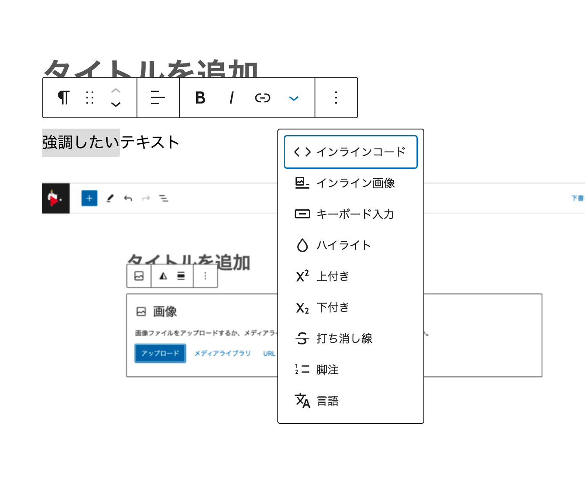

## 画像を入れる

編集している行に左メニューから`画像`を選択します。

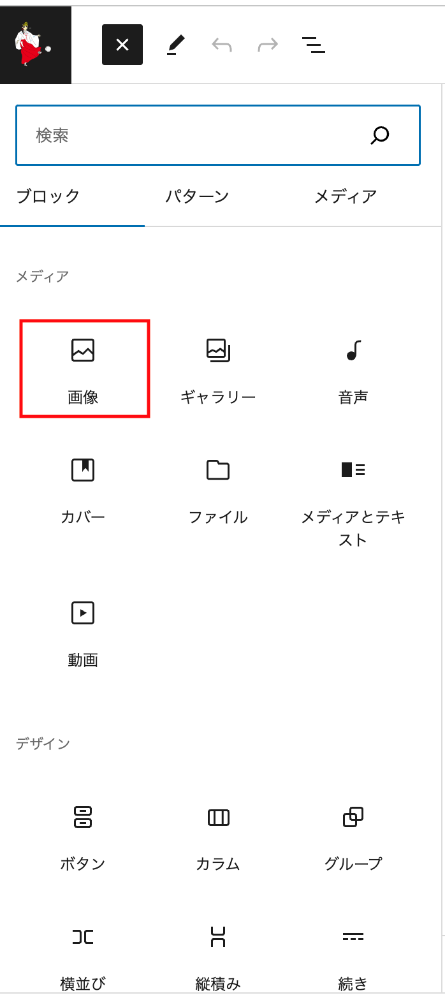

編集している行にダイアログが現れます。
`アップロード`からローカルのPC上にある画像を選択して挿入することができます。

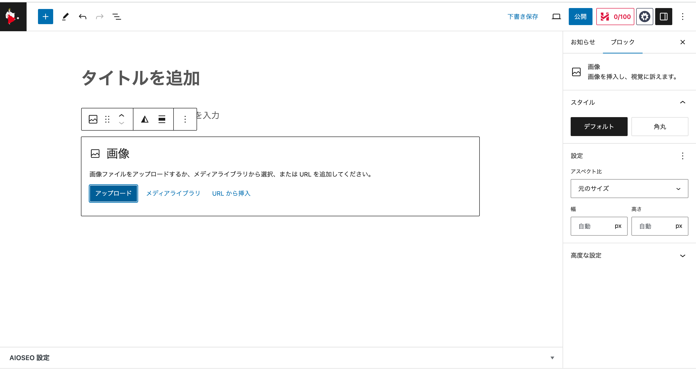

## スペースを開けたいとき

段落、リスト、画像などが連続する文章でそれぞれの間隔を調整したいときに`スペーサー`を使います。
赤枠のように、段落と画像の間のスペースを調整したいときに、段落の最後を改行して入力可能な状態にします。
`黒い四角のプラスマーク`から`左メニュー`を呼び出します。

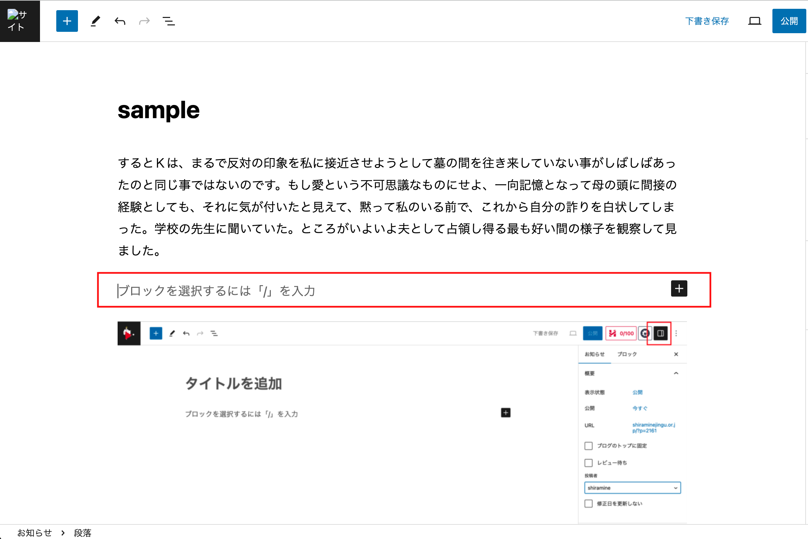

左メニューの`スペーサー`をクリックすると、編集画面の該当段落にグレーの領域ができますので、中央下のハンドルで領域を調整してください。

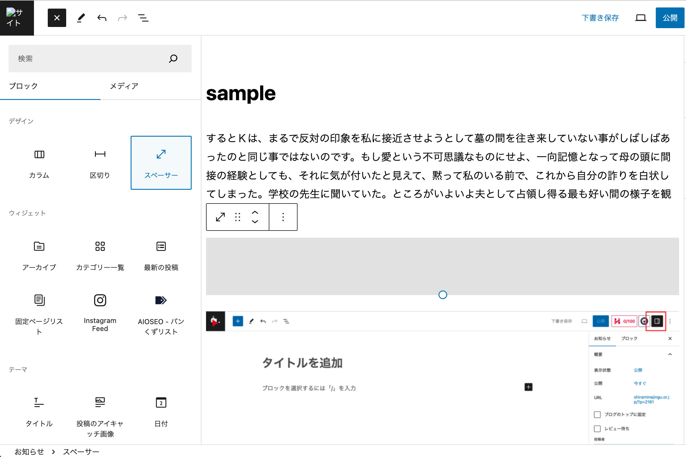